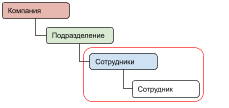
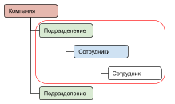
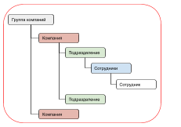
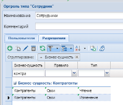

# Разграничение видимости на уровне записей
{: .no_toc }

Разграничение видимости на уровне записей выполняется через справочник “организационная структура”.

Ограничение видимости доступно для следующих объектов:

- Контрагенты                    - Запросы   
- Контакты                       - Лиды
- Предложения                    - Дела   

      Типы доступа: Чтение; Изменение.

**Важно!**
тип доступа “Чтение” соответствует роли “SR - [Сущность].Просмотр”,
тип доступа “изменение” соответствует роли “SR - [Сущность].Редактор”

**Важно!** Роли типа “SR” имеют наивысший приоритет, независимо от правил описанных ниже, доступ будет определяться по роли “SR” если она назначена пользователю.

Правила доступа представлены в таблице ниже.

Таблица. Правила доступа.

Правило | Описание | Графическое описание
------ | ------ | ------
Свои   | Только записи, где сотрудник ответственный  | 
------ | ------ | ------
Своей роли   | Все записи с правилом “свои” и записи сотрудников этой же роли  | 
------ | ------ | ------
Своей подразделения   | Записи всех сотрудников текущего подразделения  | 
------ | ------ | ------
Своей компании   | Записи всех сотрудников компании включая все подразделения  | 
------ | ------ | ------
Все  | Все записи  | 
------ | ------ | ------
Нет доступа | Без доступа |

Пример:  Сотрудникам сделать доступ только к своим записям контрагентов

1. В организационной структуре устанавливаем правила “Свои”,
как показано ниже

2. В безопасности у сотрудника удалить роли:
SR - [Сущность].Просмотр и SR - [Сущность].Редактор

