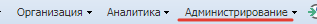
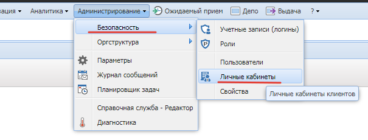
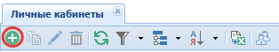
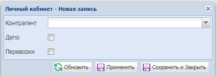

# Создание личного кабинета
{: .no_toc }

В главном меню выбираем Администрирование

Далее переходим в "Безопасность" - "Личные кабинеты"

Затем нажимаем на кнопку добавить на панели инструментов

После появится окошко для заполнения

Выбираем "контрагента" и ставите флажок в нужном месте, в результате получите следующее

