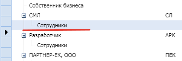

# *Управление пользователями* в оргструктуре
{: .no_toc }

- Зайти под администратором

- Перейти в Организация / Структура организации

- Установить курсор в таблице в место, где нужно добавить / удалить сотрудника,
строка должна быть с типом “Сотрудник”

- Нажать кнопку - Изменить

- В открывшемся окне на вкладке пользователи добавить/удалить сотрудника

**Важно!** Для изменения пользователя в оргструктуре необходима роль SR - Оргструктура.Редактор
