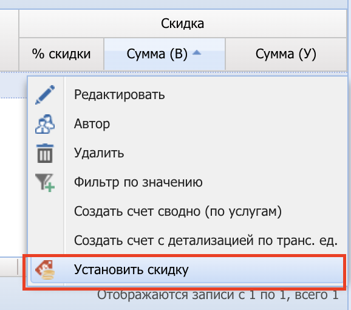

Инструкция по настройке и применению скидок

Система лояльности реализована с помощью сервиса [Teyca](https://lk.teyca.ru/system/account)

## Начальные условия использования скидок

1. Менеджеру должна быть выдана роль - “BR - Заявка. Скидка. Teyca"
2. Клиент должен быть зарегистрирован в системе лояльности, где заполнено поле “Доп. ключ 2:” - ИНН клиента.
3. Клиент с договором должен быть подключен к сисетеме лояльности:
    - Переход в раздел "Договоры" 
    - Радактировать договор 
    - В разделе "Настройки" -> Выбрать "Teyca" -> Нажать "Проверить" 

## Процесс установки сервиса клиентом

1. Клиент сканирует QR-код/ переходит по ссылке.
2. Заполняет анкету с данными: ФИО, компания, тел.
3. После отправки данных устанавливает электронную карту в Wallet.
4. При установке карты система автоматически начисляет 10000 бонусов.

ВАЖНО: заполнить ИНН в поле “Доп. ключ 2:”. ИНН будет использоваться как индивидуальный номер клиента, к которому будет привязана электронная карта.

## Процесс установки скидки

1. Необходимо открыть раздел "Заявки" 
2. Редактировать новую заявку 
3. Переходить во вкладку “Суммы клиенту” 
4. Далее выбирать перевозка при необходимости 
5. В разделе “Скидка” выбирать “Установить скидку” 
6. После этого выбрать размер скидки в бонусах 
    Описание полей:
    -  Всего (B) - общая стоимость перевозки.
 -  Всего бонусов - общее количество бонусов доступных клиенту.
 -  Доступно бонусов - количество бонусов, которые можно списать в этой перевозке (макс. 50% от стоимости перевозки).
 -  В процентах - процент скидки от стоимости перевозки.
 -  В валюте - размер скидки в бонусах (1 бонус = 1 рубль).
7. Нажать применить 

## Дополнительная информация

Скидка не может быть выставлена если:

Счет выставлен в перевозках.
Счет выставлен, т. е. скидка может быть применена  только для новых заявок.
Если нет бонусов или нет карты в Teyca.
Скидка уже была выставлена.
