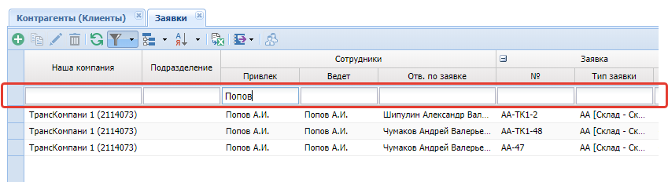
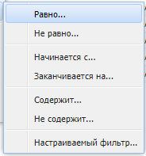
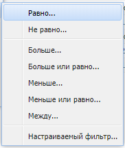
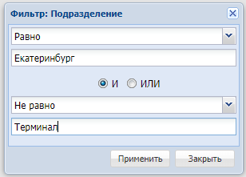
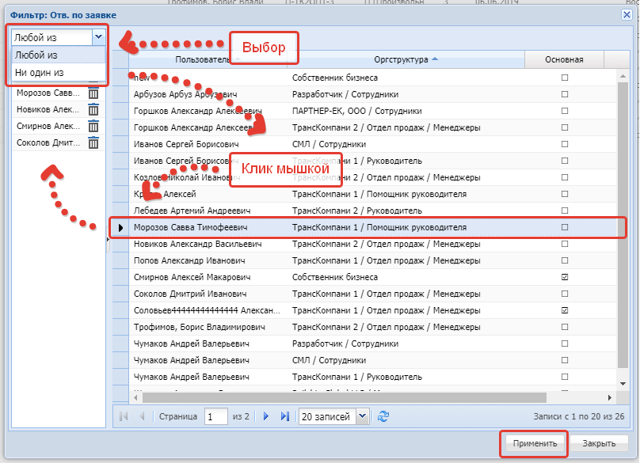

# Фильтр
{: .no_toc }
Для задания фильтрации необходимо нажать на кнопку  на [панели инструментов](../../work_window/#панель-инструментов).

Откроется новая строка фильтров.

Строки [рабочей таблицы](../work_window.md) фильтруются по условию совпадения значений.
Допускается фильтрация по нескольким столбцам.

В требуемых колонках необходимо ввести условие фильтрации.
Фильтрация данных будет применена после выхода из поля фильтрации колонки
(переход к другому полю фильтрации, щелчком по области рабочего окна системы,
либо нажатием клавиши «TAB» на клавиатуре).

## Варианты фильтрации
{: .no_toc .text-delta }

1. TOC
{:toc}

## Скрытие строки фильтра
Повторное нажатие на кнопку  не отменяет фильтрацию, а только скрывает строку с фильтрами.

## Отмена фильтра
Для отмены фильтрации требуется нажать на кнопку  "Сбросить", расположенную в подменю правой части кнопки

.

## Предопределённый фильтр
Для вызова предопределенного фильтра необходимо нажать  в заголовке столбца и перейти в меню фильтр как показано на рисунке ниже.

### Предопределённый фильтр для текстовых полей

### Предопределённый фильтр для полей c датой

### Предопределённый фильтр для полей с числами

## Настраиваемый фильтр
Вызывается аналогично настраиваемому, где в меню выбирается пункт "Настраиваемый фильтр"

### Настраиваемый фильтр для текстовых полей
Позволяет отфильтровать по нескольким значениям в одном столбце через условие "И" или "ИЛИ"
или исключить несколько значений.

### Настраиваемый фильтр для полей справочников / документов
Позволяет отфильтровать по нескольким значениям в одном столбце
или исключить несколько значений.

