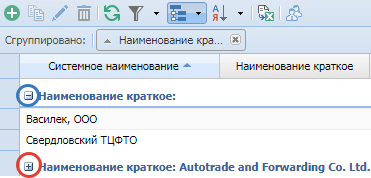
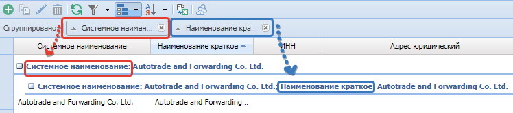
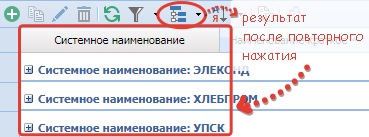
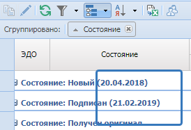

# Группировка
{: .no_toc }
Для задания группировки необходимо нажать на кнопку  на [панели инструментов](../../work_window/#панель-инструментов).

Откроется поле группировки «Сгруппировано».

После чего необходимо перенести в поле «Сгруппировано» заголовок колонки, по которой должны быть сгруппированы данные.

Как видите на изображении, заголовок колонки – Наша компания перенеслась в поле «Сгруппировано».

 

## Варианты группировки
 {: .no_toc .text-delta }

1. TOC
{:toc}

## Раскрытие и свертывание сгруппированных строк
Для того чтобы раскрыть сгруппированные строки нажмите на кнопку  около нужной группы строк,
для того чтобы свернуть группу строк нажмите на кнопку .

## Возможность группировать таблицу по нескольким колонкам
Режим группировки имеет возможность группировать таблицу по нескольким колонкам, переместив несколько заголовков колонок в поле «Сгруппировано».
В данном случае иерархия порядка группировки будет соответствовать порядку по наименованию колонок в поле «Сгруппировано».

## Повторное нажатие на кнопку «Группировка»
Повторное нажатие на кнопку «Группировка» не отменяет группировку,

а только скрывает поле «Сгруппировано».

## Для отмены группировки
Для отмены группировки по одной из колонок, необходимо в поле «Сгруппировано» в наименовании требуемой колонки нажать на кнопку .
Для отмены группировки по всем выбранным колонкам, необходимо нажать на кнопку ,
расположенную в правой части кнопки «Группировка», выбрать и нажать на кнопку «Очистить» .

## Итоги по сгруппированным строкам

Итоги по сгруппированным строкам могут быть рассчитаны по числовым  значениям, а если текстовые, то без подсчета.

