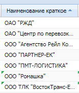
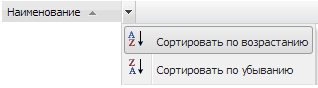
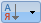
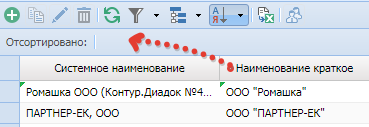
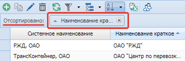

# Сортировка
{: .no_toc }
Для сортировки записей по значениям в колонке необходимо:
- Нажать на заголовок колонки, по которой требуется отсортировать строки.
После нажатия на заголовке должен появиться значок ▽ или △. Значки △ и ▽ показывают порядок сортировки – по возрастанию и по убыванию – соответственно.

- Вызвать контекстное меню заголовка колонки (нажать левой кнопкой мыши на правую часть заголовка колонки)
и выбрать соответствующий вариант сортировки «Сортировать по возрастанию» или «Сортировать по убыванию».

- Сортировать содержимое колонок через меню «Сортировка» панели управления.
Для задания сортировки необходимо нажать на кнопку «Сортировка»  на [панели инструментов](../../work_window/#панель-инструментов)
таблицы, после чего откроется поле сортировки «Отсортировано».

После чего необходимо перенести в поле «Отсортировано» заголовок колонки, по которой должны быть отсортированы данные.
Установите режим сортировки по возрастанию или по убыванию, нажав на соответствующий заголовок колонки в поле сортировки.

В описанном выше режиме сортировки имеется возможность сортировать таблицу по нескольким колонкам, переместив несколько заголовков в поле «Отсортировано».
В данном случае иерархия порядка сортировки будет соответствовать порядку колонок в поле «Отсортировано».

Повторное нажатие на кнопку Сортировка не отменяет сортировку, а только скрывает поле «Отсортировано».
Для отмены сортировки по одной из колонок, необходимо в поле «Отсортировано» в наименовании требуемой колонки нажать на кнопку .
Для отмены сортировки по всем выбранным колонкам, необходимо нажать на кнопку , расположенную в правой части кнопки «Сортировка», выбрать и нажать на кнопку «Очистить» .
