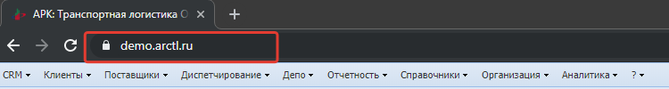
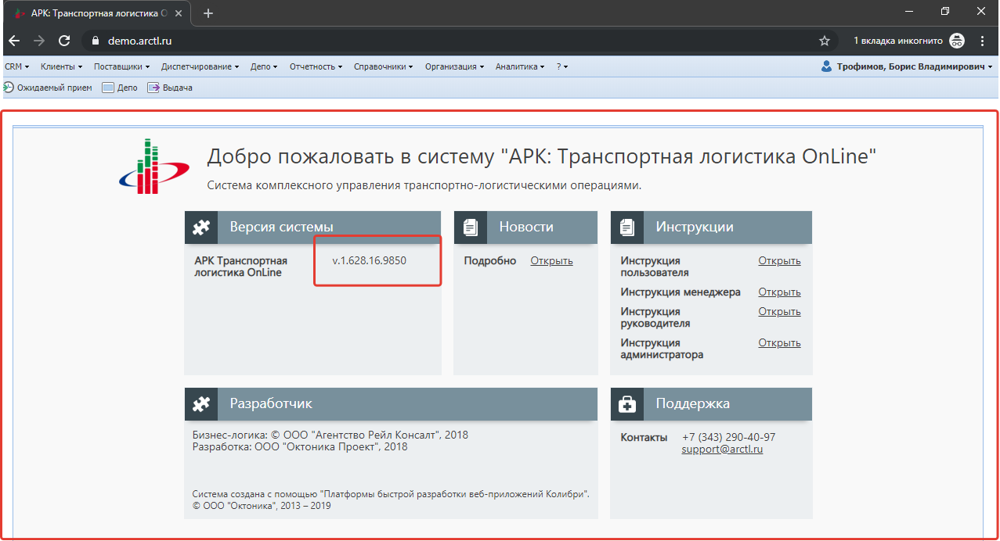

# Главное окно
{: .no_toc }

После входа в систему вы окажетесь на главной странице системы (Рисунок ниже)

## Блоки системы
{: .no_toc .text-delta }

1. TOC
{:toc}

## Адресная строка браузера

## Главное меню системы

## Меню пользователя

## Основное рабочее окно
В этой области будут отображаться все формы системы.
Кроме того на начальном экране отображается версия системы.

