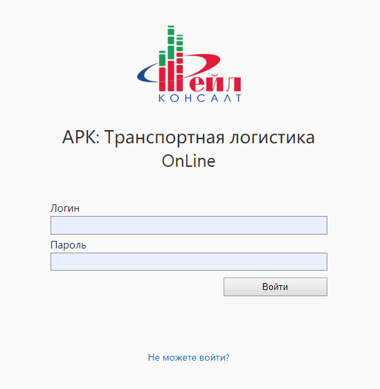
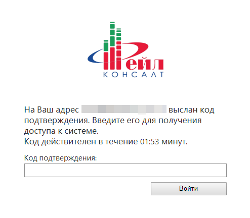
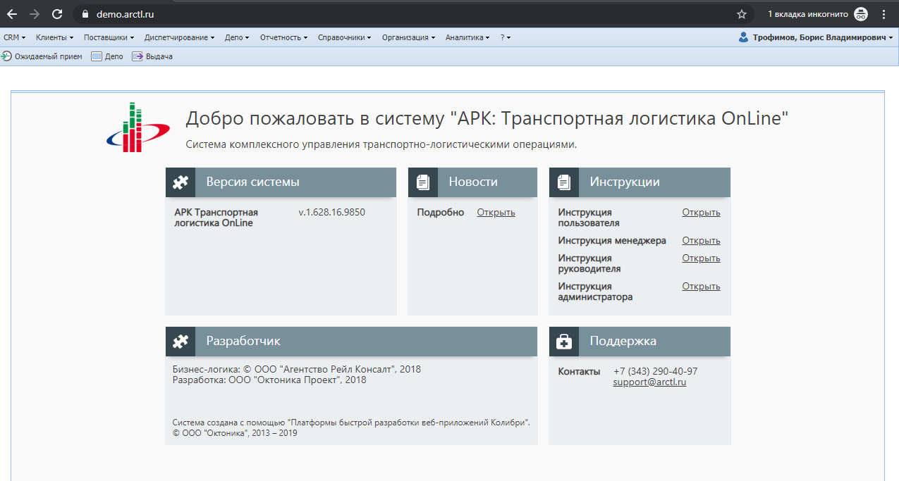

# Вход
{: .no_toc }

## Содержание
{: .no_toc .text-delta }

1. TOC
{:toc}

## Открыть страницу входа

Для работы в системе необходимо запустить веб-браузер.
В открывшемся окне браузера, в адресной строке необходимо ввести реквизиты (url-адрес) для входа в систему.

Пример: [demo.arctl.ru](https://demo.arctl.ru/)

Узнать необходимые реквизиты вы можете у администратора либо специалиста, от которого вы узнали о системе и необходимости работы в ней. Откроется страница для входа в систему.

Примечание:
Для быстрого доступа к системе можно создать «Закладку» в браузере для адреса системы или установить его как «Домашнюю страницу».

## Аутентификация
Что бы начать работу в системе необходимо пройти процесс аутентификации (далее «Вход в систему»).
Для этого на стартовой странице необходимо заполнить поля «Логин», «Пароль», полученные при регистрации в системе, и нажать на кнопку «Войти».

Если подключена двухэтапная авторизация, то необходимо ввести отправленный код в следующем окне.

## Главное окно системы

Если аутентификация пройдена успешно, то откроется главное окно системы

