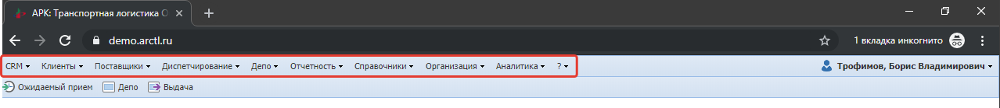

Система АРК: Транспортная логистика Online представляет собой веб-приложение,
доступ к которому осуществляется с использованием Веб-браузера.

Для работы в системе необходимо установить на рабочей станции пользователя один из следующих Веб – браузеров:
- Google Chrome [последняя версия](http://www.google.com/chrome?hl=ru);
- Mozilla FireFox [последняя версия](http://mozilla-russia.org/);
- Internet Explorer [10.0 и выше](http://windows.microsoft.com/ru-RU/internet-explorer/downloads/ie);
- Yandex [последняя версия](https://browser.yandex.ru/).

Рекомендуется использовать **Google Chrome**

- Инструкция пользователя (google docs) [ссылка](https://docs.google.com/document/d/1HFA_BUoj91hiWMuCWXu9Alju049u1F2z6fDVr7pWpKc/edit#heading=h.rh19eeozgxde)

## Вход

### Открыть страницу входа

Для работы в системе необходимо запустить веб-браузер.
В открывшемся окне браузера, в адресной строке необходимо ввести реквизиты (url-адрес) для входа в систему.

Пример: [demo.arctl.ru](https://demo.arctl.ru/)

Узнать необходимые реквизиты вы можете у администратора либо специалиста, от которого вы узнали о системе и необходимости работы в ней. Откроется страница для входа в систему.

Примечание:
Для быстрого доступа к системе можно создать «Закладку» в браузере для адреса системы или установить его как «Домашнюю страницу».

### Аутентификация
Что бы начать работу в системе необходимо пройти процесс аутентификации (далее «Вход в систему»).
Для этого на стартовой странице необходимо заполнить поля «Логин», «Пароль», полученные при регистрации в системе, и нажать на кнопку «Войти».

Если подключена двухэтапная авторизация, то необходимо ввести отправленный код в следующем окне.

## Главное окно системы

Если аутентификация пройдена успешно, то откроется главное окно системы

## Главное меню

Навигация по системе осуществляется через главное меню системы (Рисунок нижн).

После выбора пункта из главного меню системы
в [рабочем окне](work_window.md) системы откроется журнал (таблица содержащая):
- справочник;
- документ.

## Меню «Справка»

В главном меню системы находится меню «Справка», обозначенное кнопкой.
Меню позволяет перейти к странице “О системе” (Рисунок ниже) и «Справка» в которой находятся инструкции для работы в системе.

Для того чтобы скачать инструкцию на локальный компьютер, необходимо напротив требуемого документа нажать на ссылку «Скачать», после чего выбрать директорию для сохранения файла на локальном компьютере.

## Печать документов

Формирование документов возможно различными методами в зависимости от задачи.
Детально формирование документов описано в инструкциях к отдельным функциональным модулям системы.

### Работа с печатными документами

Документы формируются на отдельной вкладке рабочего окна системы.
Для работы со сформированными отчетами во вкладке отчетов находится панель инструментов

## Бизнес правила

В системе могут быть предусмотрены контроли на заполнение данных (далее бизнес-правила). В системе существует два типа бизнес-правил:
- критичное бизнес-правило, нарушение которого не позволяет сохранить изменение в базу данных;
- некритичное бизнес-правило, нарушение которого позволяет сохранить изменение в базу данных.

### Критичное бизнес-правило

При добавлении строки и нарушении критичных бизнес-правил возникает красное сообщение с полным перечнем всех нарушенных критичных правил, и открывается форма для редактирования строки (Рисунок ниже).
При редактировании строки и нарушении критичных бизнес-правил возникает красное сообщение с полным перечнем всех нарушенных критичных правил, внесенные изменения не сохраняются.

Слева от наименования формы редактирования отображено общее число нарушенных бизнес-правил. Вкладка, на которой расположено поле с нарушенным бизнес-правилом будет помечена красным цветом. На форме для редактирования, все поля, в которых нарушено бизнес-правило, подчеркиваются. При наведении на подчеркнутое поле будет выведено нарушенное правило (Рисунок ниже).
Сохранение изменений будет возможно только после исправления всех нарушенных критичных бизнес-правил.

###  Некритичное бизнес-правило

При заведении данных и нарушении некритичного бизнес-правила возникает желтое сообщение с полным перечнем всех нарушенных правил (Рисунок ниже). Нарушение некритичных бизнес-правил не препятствует сохранению данных.

Слева от наименования формы отображено общее число нарушенных бизнес-правил. Вкладка, на которой расположено поле с нарушенным бизнес-правилом будет помечена красным цветом. На форме для редактирования, все поля, в которых нарушено бизнес-правило, подчеркиваются. При наведении на подчеркнутое поле будет выведено нарушенное правило.
