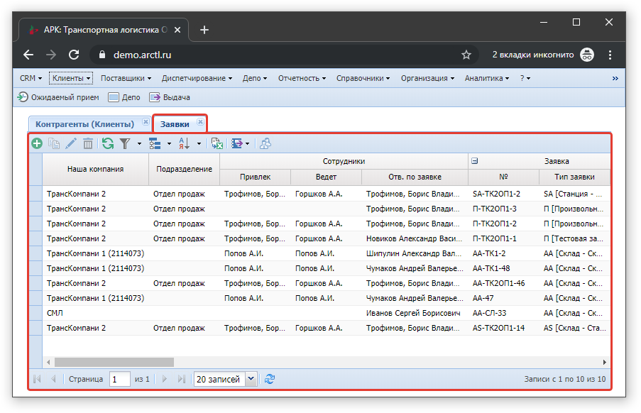
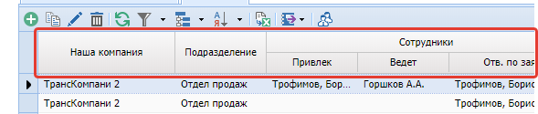
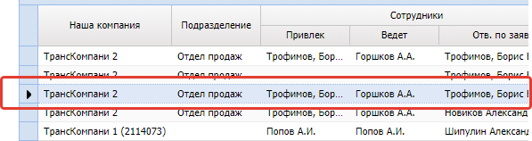

# Рабочее окно
{: .no_toc }

Основное `Рабочее окно` системы представлено на Рисунке ниже

## Состав окна
{: .no_toc .text-delta }

1. TOC
{:toc}

## Вкладки
Журналы (таблицы) с данными:
- справочники;
- документы

открываются во вкладках внутри рабочего окна системы (рисунок ниже).

Для закрытия вкладки справочника, таблицы с данными необходимо нажать на кнопку,
находящуюся справа от наименования вкладки.

## Активна вкладка
Содержит данные и основные инструменты управления и навигации.

### Рабочая таблица
Под названием вкладки размещается рабочая таблица (грид)
Она содержит данные выбранного журнала (справочника или документа).

### Панель инструментов
Панель инструментов управляет рабочей таблицей.
Она содержит [основные команды](/grid_tools/tools.md) доступные для применения к таблице.

### Столбцы
Столбцы журнала.

### Текущая строка
Текущая строка журнала отмечается индикатором
 и фоновым цветом строки.

### Редактирование в ячейке
Если у ячейки строки левый верхний угол окрашен зеленым цветом
,
то данные могут быть изменены непосредственно в ней.

.

### Строка навигации
Под рабочей таблицей расположена строка навигации.
Она содержит информацию о просматриваемой странице.

