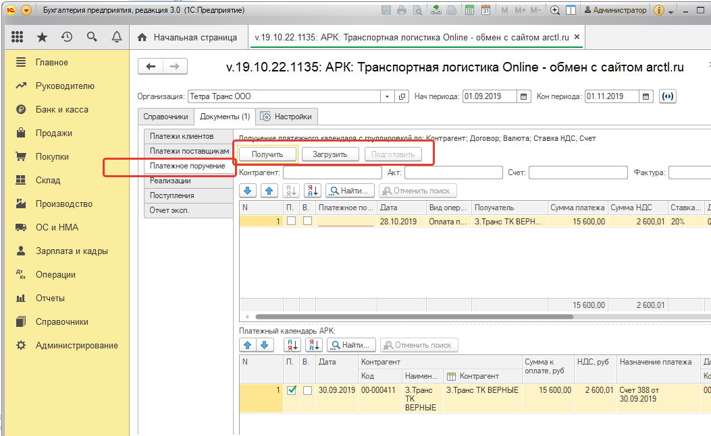

## Возможности
Интеграция реализована для конфигураций 1С:Предприятие 8.3:
- Бухгалтерия предприятия, редакция 3.0

Обмен осуществляется со стороны 1С с использованием внешней обработки “АРК Транспортная Логистика обмен с сайтом arctl.ru”. С помощью обработки указанной обработки осуществляется загрузка в 1С новых элементов справочников и документов, выгрузка платежей в АРК а также выполняется связь имеющихся данных в 1С и АРК.

Таблица. Обмен 1C и АРК Транспортная Логистика

Объект 1С | Объект АРК | Загрузка | Связь | Выгрузка | Режимы
------ | ------ | ------ | ------ |------ | ------
Организаций   | Организация > Наши компании | | Да | | |
------ | ------ | ------ | ------ |------ | ------
Контрагенты   | CRM > Контрагенты | Да | Да | | Новые, загружены, все |
------ | ------ | ------ | ------ |------ | ------
Договоры   | CRM > Договоры | Да | Да | | Новые, загружены, все |
------ | ------ | ------ | ------ |------ | ------
Номенклатура   | Справочники > Шаблоны заявок > Услуги | Да | Да | | Новые, загружены, все |
------ | ------ | ------ | ------ |------ | ------
Поступление на расчетный счет   | Клиенты > Платежи | | | Да | |
------ | ------ | ------ | ------ |------ | ------
Списание с расчетного счета   | Поставщики > Входящие документы | | | Да | |
------ | ------ | ------ | ------ |------ | ------
Реализация (акты, накладные)   | Клиенты > Акты / счет-фактуры | Да | | | Новые, загружены, все |
------ | ------ | ------ | ------ |------ | ------
Поступления (акты, накладные)   | Поставщики > Входящие документы | Да | | | Новые, загружены, все |
------ | ------ | ------ | ------ |------ | ------
Отчеты комитентам   | Клиенты > Отчет экспедитору | Да | | | Новые, загружены, все |
------ | ------ | ------ | ------ |------ | ------
платежные поручения   | клиенты > исходящие экспедитору | Да | | | Новые, загружены, все |

**Важно!** Обмен реализован для 1С Бухгалтерия: 3.0.ХХ.ХХ

**Важно!** При установки связи в АРК записывается код объекта из 1С, далее обмен выполняется используя это код. Изменяя код в 1С нарушается связь.

**Важно!** При изменении ранее выгруженного документа в АРК необходима повторная выгрузка в 1С. Изменения документов не отслеживаются. При загрузке документ перезаписывается.

## Загрузка обработки

Последняя версия обработки АРК Транспортная Логистика обмен с сайтом arctl.ru всегда находится по следющему адресу: [Яндекс Диск](https://yadi.sk/d/yPQwBFdNiH0Ssg).

Рекомендуем после загрузки добавить обработку в дополнительные отчеты и обработки.

## Добавление в дополнительные отчеты и обработки

Открыть печатные формы и обработки

Затем открыть дополнительные отчеты и обработки

В открывшемся окне добавляем обработку

В окне предупреждения нажать продолжить

Выбрать файла обработки

Установить в размещение в разделах

Указать где размещать

Затем нажимаем записать и закрыть

В любом из разделов где ранее указали размещение необходимо настроить список для отображения, для этого переходим в раздел и нажимаем дополнительные обработки

В открывшемся окне выбрать настроить список

Выбрать нашу обработку

Все на этом завершена настройка отображения. Выполняется это один раз при первом размещении внешней обработки.

## Запуск внешней обработки

### Из списка обработок

Если обработка добавлена в 'дополнительные отчеты и обработки'

В разделе “Продажи, “Покупки”, “Банк и касс” (раздел определяет администратор) используя меню дополнительные обработки.

Затем

### Через файл

В меню нажимаем “Файл” затем открыть, где выбрать путь к загруженной обработке

### Через сохраненный путь

Если ранее открывали, в меню нажимаем “Файл” затем выбираем сохраненный путь

[Ссылка](http://docs.arctl.ru/docs/integration/1c_adding_processing/)

## Начало работы с обработкой

Перед использованием обработки необходимо после ее запуска выполнить настройку следующих пунктов:

Настроить подключение. На вкладке настройки указать http, пользователь, пароль, как показано ниже

Добавить внешнюю систему в АРК. Для этого необходимо скопировать имя внешней системы как показано ниже

Затем добавить в  АРК Транспортная Логистика скопированное имя как показано ниже.

Проверить подключение. Для этого необходимо в обработке нажать кнопку получить как показано ниже. Если получен длинный код (уникальный идентификатор), то обмен настроен.

# Обмен данными

Перед обменом данными необходимо связать нашу компанию в АРК Транспортная Логистика и организацией в 1С, как показано на
рисунке ниже. Выбираем организацию соответствующую нашей компании и нажимаем кнопку связать.

## Загрузка платежных поручений из платежного календаря

Порядок действий:

1. В 1С получить строки платежного календаря и подготовить платежные поручения (Бухгалтер)
Открыть форму обработки на вкладке `Документы - Платежные поручения` нажать `получить`

При нажатии кнопки `Получить` система автоматически:
- получает строки платежного календаря:
  - только акцептованные;
  - ранее не загруженные;  
  - с учетом периода по полю `План. дата`
- подготавливает загрузку, группируя по полям:
  - Получатель (контрагент);
  - Договор;
  - Валюта;
  - Ставка НДС;
  - Счет;

2. Перед загрузкой можно скорректировать поля:
- дата;
- назначение платежа;
- и др.

### В 1С загрузить (создать) платежные поручения (Бухгалтер)
В форме обработки на вкладке `Документы - Платежные поручения` нажать `Загрузить`.
Система создаст платежные поручения и заполнит поле `Платежное поручение`.
Заполнение этого поля означает успешную загрузку.

[Права доступа в 1C](http://docs.arctl.ru/docs/integration/acess_rights_c/)

## Проверка версии обработки

Версия обработки указывается в заголовке обработки после ее открытия как показано ниже.

## Права доступа в 1С

В 1С права доступа доступа должны аналогичные профилю групп доступа “Бухгалтер”, дополнительно включается “Запуск внешнего соединения“ и “Интерактивное открытие внешних отчетов и обработок” как рассказано ниже.
Добавить новый профиль можно через меню “Профили групп доступа” (Администрирование > Настройки пользователей и прав > Профили групп доступа). Ниже показано как должен выглядеть профиль. В названии указать “Синхронизация данных с АРК”

Затем новый профиль необходимо добавить пользователю через меню “Пользователи” (Администрирование > Настройки пользователей и прав > Пользователи), где выбрать нужного пользователя добавить в правах созданный профиль.

**Важно!** Если пользователь не администратор, то работа обработки может выполняться если она включена в дополнительные отчеты и обработки.

----
## Включение отладки
Включение отладки при выполнении POST запросов.

## Дополнительные обработки
Поиск и замена значений, [Яндекс Диск](https://yadi.sk/d/aRiwirfhi58p0A)
Групповое изменение реквизитов, [Яндекс Диск](https://yadi.sk/d/PHKVlkmcCjrrmw)
